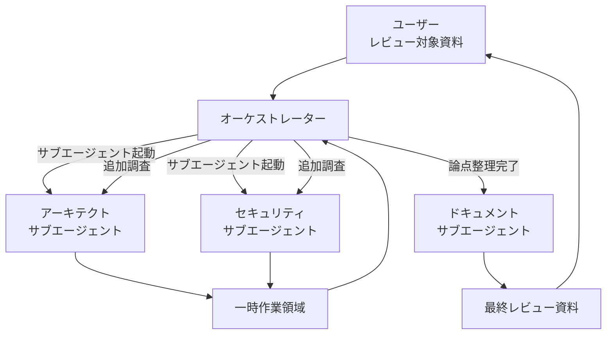
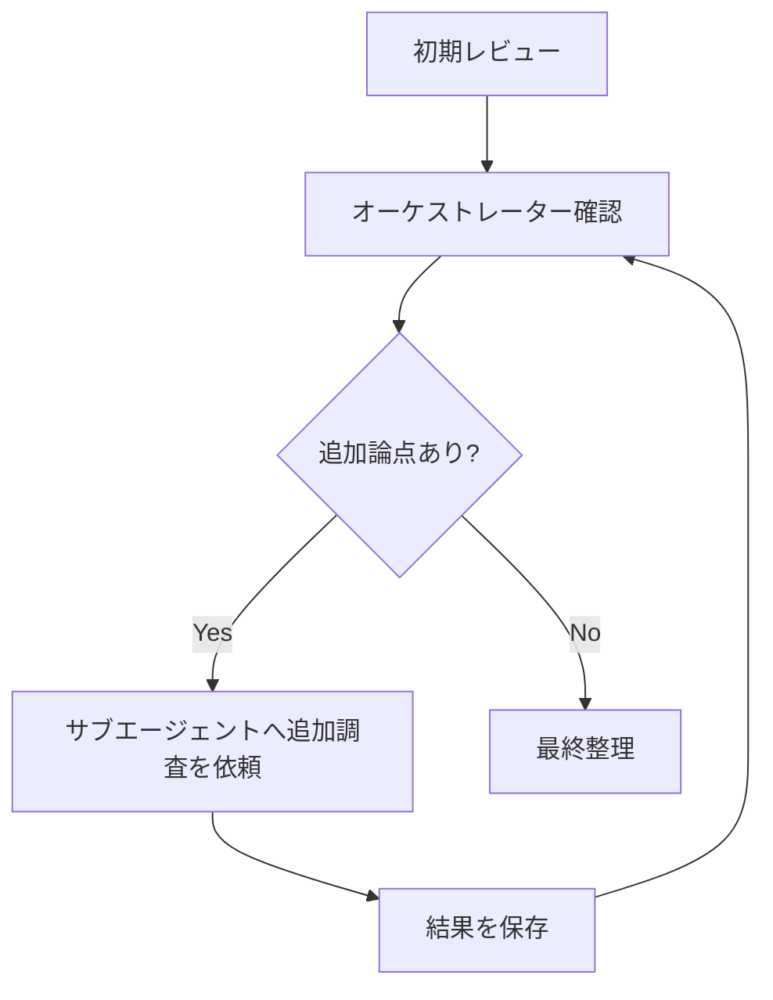

# Architecture Review

アーキテクチャ検討資料を入力として受け取り、複数の専門サブエージェントによるレビューを反復的に行う。

オーケストレーターが単発で各サブエージェントに一度ずつレビューさせて終了するのではなく、**オーケストレーターが各レビュー結果を確認し、追加調査が必要な論点を判断して、必要なサブエージェントへ再度作業を依頼する**。

レビュー作業の履歴は一時作業ディレクトリへ保存し、後続のサブエージェントやオーケストレーターが正確に参照できる状態を維持する。

---

# ゴール

このスキルの目的は、単純な設計上の誤りを見つけることではない。

以下を総合的に評価し、プロジェクトにとって現実的で持続可能なアーキテクチャへ改善することである。

- 要件を適切に満たしているか
- 技術的に成立するか
- ベストプラクティスに沿っているか
- セキュリティ上の重大な問題がないか
- 対象業界・ドメイン固有の要件を満たしているか
- 短期的な開発速度だけを優先していないか
- 中長期的な変更容易性が確保されているか
- 運用・監視・障害対応が現実的か
- 開発コストだけでなく、保守・運用コストも妥当か
- 不必要に複雑な設計になっていないか

最終的には、単なる「問題点の列挙」ではなく、

> 現在の設計をどのように評価し、何を残し、何を変更すべきか

が明確になるレビュー結果を作成する。

---

# マルチエージェント構成

このスキルは、1つのオーケストレーターと複数の専門サブエージェントによるマルチエージェントで実行する。

- **オーケストレーター**: レビュー全体を統括する。自らすべての専門レビューを行わず、Agent（Task）ツールでサブエージェントを起動し、その結果を統合して次のアクションを判断する。
- **サブエージェント**: オーケストレーターから起動され、担当領域を独立してレビューする専門家。以下の3種類を用いる。

| サブエージェント | 役割 | 詳細 |
| --- | --- | --- |
| アーキテクト | アーキテクチャ・クラウド設計・保守運用・TCOを評価 | [references/architect.md](references/architect.md) |
| セキュリティ | セキュリティ・脅威モデリング・業界ドメイン固有要件を評価 | [references/security.md](references/security.md) |
| ドキュメント | 統括結果を最終レビュー資料へ文書化 | [references/document.md](references/document.md) |



各サブエージェントは独立して作業するが、作業結果は必ず一時作業領域へ保存する。

後続の作業では、会話上の記憶だけに頼らず、保存された作業結果を参照する。

---

# オーケストレーター

## 役割

非常に優秀なリードエンジニアとして、マルチエージェントレビュー全体を統括する。

自らすべての専門レビューを行うのではなく、適切な専門サブエージェントへ調査を依頼し、その結果を統合して次のアクションを判断する。

## 主な責務

- レビュー対象資料を最初に把握する
- プロジェクトの目的・制約・前提条件を整理する
- レビューすべき論点を洗い出す
- 各サブエージェントへ調査・レビューを依頼する
- 各サブエージェントの作業結果を確認する
- 指摘同士の矛盾を解消する
- 未調査の論点を特定する
- 追加調査が必要なサブエージェントを選定する
- 必要であれば同じ種類のサブエージェントへ複数回作業を依頼する
- レビューの優先順位を決定する
- 最終的なレビュー方針を整理する
- ドキュメントサブエージェントへ最終資料の作成を依頼する
- 追加調査すべき事項がなくなった時点でレビューを終了する

## 重要な行動原則

レビュー開始時点ですべてのタスクを固定してはならない。

各サブエージェントの調査結果によって、新しい論点が発見されることを前提とする。

例えば以下のように進める。

```text
1. アーキテクトサブエージェントへ全体レビューを依頼
2. セキュリティサブエージェントへ初期レビューを依頼
3. 結果を確認
4. アーキテクトの指摘から可用性の問題を発見
5. アーキテクトサブエージェントへ障害設計の追加調査を依頼
6. セキュリティの指摘から医療情報管理の問題を発見
7. セキュリティサブエージェントへ医療ガイドライン観点の追加調査を依頼
8. 新しい重大論点がなくなるまで繰り返す
9. ドキュメントサブエージェントへ最終整理を依頼
```

## オーケストレーターが管理するもの

最低限、以下を常に管理する。

- 確認済みの論点
- 未確認の論点
- 重大なリスク
- 各サブエージェントへの依頼履歴
- 各サブエージェントからの回答
- 追加調査の要否
- 最終資料へ記載すべき内容

---

# サブエージェントの起動

オーケストレーターは、各レビューを自ら実施せず、Agent（Task）ツールでサブエージェントを起動して実行させる。

## 起動手順

汎用サブエージェント（`general-purpose`）を起動し、プロンプトで担当ロールを与える。起動時には、各サブエージェントへ最低限以下を渡す。

- 担当ロールの定義ファイル（`references/architect.md` / `references/security.md` / `references/document.md`）を最初に読むよう指示
- 参照すべき入力資料・過去の作業結果のパス（`source/`, 自分と他サブエージェントの過去 `review-NNN.md`）
- Task ID と、具体的な依頼内容（何を調査してほしいか）
- 出力先（`tmp/architecture-review/<role>/review-NNN.md`）と、後述の作業結果フォーマット

## 並列と直列

- 依存関係のない初期レビュー（アーキテクトとセキュリティなど）は、同時に起動してよい。
- 追加調査は、直前の結果を踏まえて依頼するため、通常は結果を確認してから起動する。
- ドキュメントサブエージェントは、オーケストレーターが論点を整理し終えてから最後に起動する。

## サブエージェントへの指示原則

- 他サブエージェントの結論を無条件に採用せず、自分の専門領域から独立して評価させる。
- 会話の記憶ではなく、一時作業領域に保存された作業結果を参照させる。
- 作業結果は必ず一時作業領域へ、連番で保存させる（既存ファイルを上書きしない）。

各サブエージェントの詳細なレビュー観点は、それぞれのロール定義ファイルに切り出してある。

- アーキテクト: [references/architect.md](references/architect.md)
- セキュリティ: [references/security.md](references/security.md)
- ドキュメント: [references/document.md](references/document.md)

---

# 一時作業領域

各サブエージェントの作業結果を、必ず一時作業領域へ保存する。

## 配置場所

一時作業領域は、**レビュー対象PJのルート直下（カレントディレクトリからの相対パス）** に作成する。

- マシン共通の `/tmp` など、絶対パスのグローバル領域には作成しない。PJをまたいで作業結果が衝突・混在するのを避けるため、必ずPJごとに分離する。
- 作業成果物を誤ってコミットしないよう、対象PJの `.gitignore` に `tmp/` を追加する（既に無視されている場合は不要）。
- 相対パスのため、複数の依存関係のないPJでレビューしても、各PJの `tmp/architecture-review/` が独立して保たれる。

推奨ディレクトリ構成（PJルートからの相対）:

```text
tmp/architecture-review/
├── source/
│   └── review-target.md
│
├── orchestrator/
│   ├── review-plan.md
│   ├── issues.md
│   ├── decisions.md
│   └── task-history.md
│
├── architect/
│   ├── review-001.md
│   ├── review-002.md
│   └── review-003.md
│
├── security/
│   ├── review-001.md
│   ├── review-002.md
│   └── review-003.md
│
├── document/
│   └── final-review.md
│
└── manifest.md
```

既存ファイルを上書きして作業履歴を失わないこと。

同じ種類のサブエージェントが複数回作業する場合は、連番で保存する。

---

# manifest.md

一時作業領域には、レビュー全体の状態を把握できる `manifest.md` を作成する。

各作業完了時にオーケストレーターが更新する。

---

# 作業依頼の管理

オーケストレーターから各サブエージェントへの依頼には、一意なTask IDを付ける。

推奨形式:

```text
AR-001
AR-002

SE-001
SE-002

DOC-001
```

各作業結果には必ず以下を記載する。

```markdown
# Task

AR-002

## Request

可用性・障害復旧設計について追加レビューする。

## Referenced Files

- source/review-target.md
- architect/review-001.md
- security/review-001.md

## Findings

...

## Risks

...

## Recommendations

...

## Questions / Additional Investigation

...
```

これにより、オーケストレーターが何を依頼し、何が調査され、何がまだ未解決なのかを正確に追跡できるようにする。

---

# レビューフロー

## Phase 1: 入力資料の読み込み

オーケストレーターが、レビュー対象となるすべての資料を読み込む。

複数のファイルがある場合は、可能な限りすべて確認する。

資料から以下を整理する。

- プロジェクト目的
- システム概要
- 利用者
- 対象ドメイン
- アーキテクチャ
- 利用技術
- インフラ
- データ
- 外部連携
- セキュリティ要件
- 非機能要件
- 制約
- 未決定事項

---

## Phase 2: 初期レビュー計画

オーケストレーターが資料を確認し、初期レビュー計画を作成する。

最低限、以下を記載する。

- システム概要
- レビュー対象
- 主要なレビュー観点
- 不明点
- 初期調査タスク

通常は最初に、アーキテクトサブエージェントとセキュリティサブエージェントへそれぞれ初期レビューを依頼する。

---

## Phase 3: 専門サブエージェントレビュー

各サブエージェントが担当領域をレビューする。

レビュー結果は一時作業領域へ保存する。

サブエージェントは自分の過去のレビュー結果と、必要な他サブエージェントのレビュー結果を参照してよい。

ただし、他サブエージェントの結論を無条件に採用せず、自分の専門領域から独立して評価する。

---

## Phase 4: オーケストレーターによる統合

オーケストレーターがすべての最新レビュー結果を確認する。

以下を整理する。

- 合意している指摘
- 意見が異なる指摘
- 新しく発見された論点
- 未調査の論点
- 追加確認が必要な事項

オーケストレーターはこの時点でレビューを終了してはならない。

必ず、

> 追加調査によってレビュー結果が大きく改善する可能性があるか

を判断する。

---

## Phase 5: 追加調査

必要な場合は、適切なサブエージェントへ追加レビューを依頼する。

同じ種類のサブエージェントへ何度依頼してもよい。



追加調査では、調査対象を具体的に指定する。

---

# 終了条件

以下の状態になるまでレビューを継続する。

- Criticalな論点がすべて特定されている
- Highな論点が十分に調査されている
- 主要なアーキテクチャ判断が評価されている
- セキュリティ上の主要リスクが評価されている
- ドメイン固有の主要リスクが評価されている
- 保守・運用上の主要課題が評価されている
- 主要な追加調査事項が残っていない
- 各指摘に対して推奨対応を示せる

単に一定回数レビューしたことを終了条件にしてはならない。

オーケストレーターが、

> 現時点で追加の専門サブエージェント調査を実施しても、レビュー結果を大きく改善する新しい重要論点が得られる可能性が低い

と判断した時点で専門レビューを終了する。

---

# 指摘の優先順位

## Critical

本番利用前に解決すべき問題。

## High

早期に解決すべき重要な問題。

## Medium

中期的に改善すべき問題。

## Low

改善すると望ましい事項。

---

# レビュー時の原則

## 問題を探すことを目的にしない

良い設計は明確に評価する。

## ベストプラクティスを絶対視しない

プロジェクト規模・予算・開発速度によっては、ベストプラクティスを完全適用しない判断も合理的である。

重要なのは、意図的なトレードオフかを確認すること。

## 過剰設計を推奨しない

将来必要になる可能性があるという理由だけで、現時点で不要な複雑性を導入しない。

## 推測と事実を分離する

以下を区別する。

- 資料から確認できる事実
- 合理的な推測
- 不明点
- 推奨事項

## 指摘には理由を書く

## 改善案にはトレードオフを書く

改善案によって、コスト・複雑性・開発速度・運用負荷がどう変化するかも可能な限り説明する。

---

# 最終報告

すべてのレビューとドキュメント作成が完了したら、オーケストレーターがユーザーへ報告する。

報告には最低限、以下を含める。

- レビュー完了
- 総合評価
- 最重要な指摘
- 作成した最終レビュー資料
- 未解決事項がある場合はその内容

内部の作業履歴をすべてユーザーへ出力する必要はない。

ただし、最終レビューの根拠として必要な情報は、最終資料へ反映すること。
