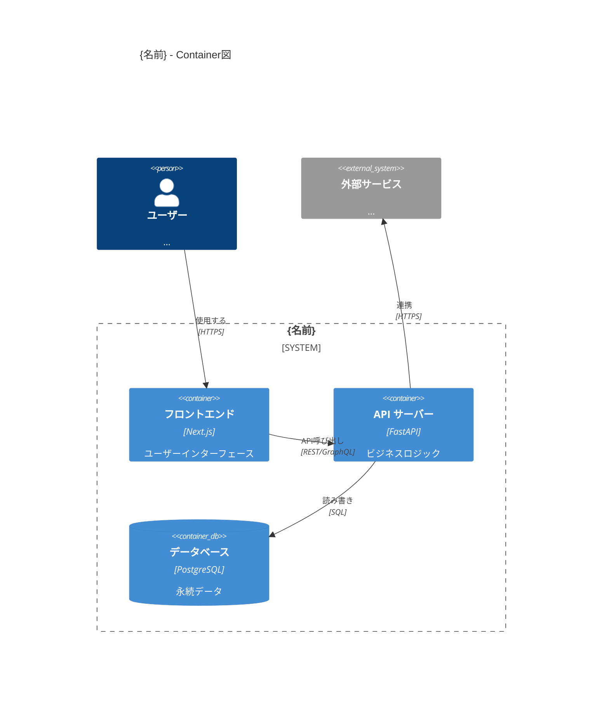
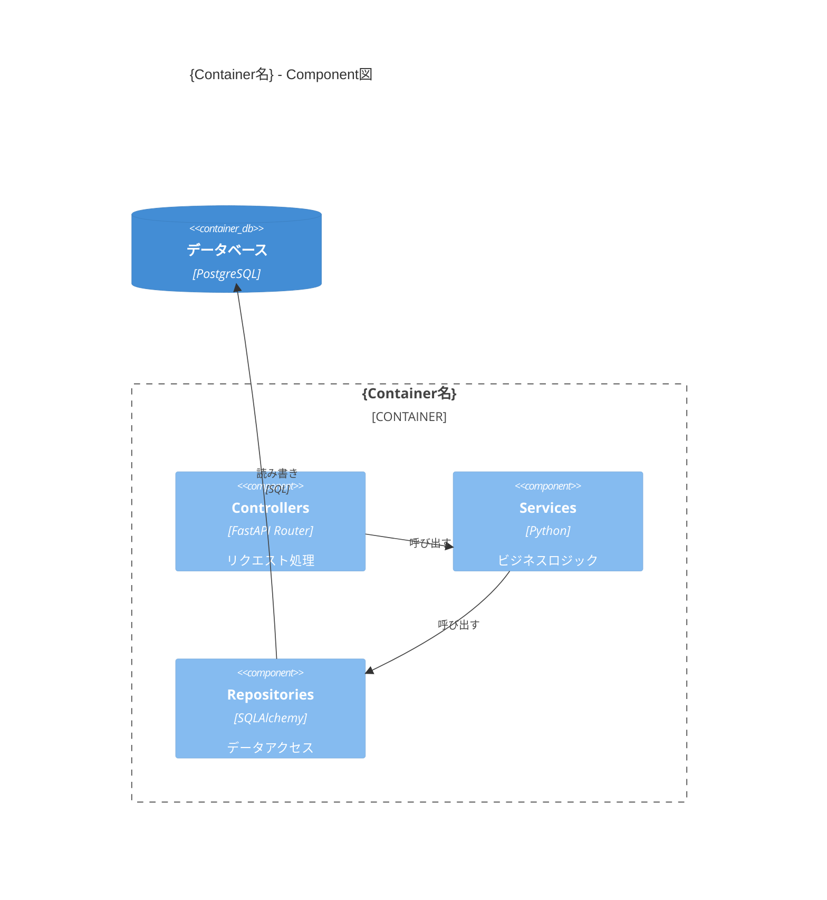

# C4 アーキテクチャ図生成スキル

任意のコードベースを調査し、C4モデルの **Container図（Level 2）** と **Component図（Level 3）** を Mermaid C4 記法で生成する。コードの実態に基づいて図を生成し、`outputs/c4/` 配下に Markdown で出力する。

詳細な Mermaid C4 記法は [reference/mermaid-c4-notation.md](reference/mermaid-c4-notation.md) を参照（書き始める直前に必ず読むこと）。

## 対象の解決

1. ユーザーがパス・ディレクトリ・サブプロジェクト名を指定した場合は、それを対象とする
2. 指定がなければ **カレントの作業ディレクトリ全体** を対象とする
3. 対象が複数ある場合（例: モノレポの複数サービス）は、それぞれ個別に図を生成し、最後にサービス間連携を示す **全体Container図** をまとめる
4. 対象が曖昧な場合はユーザーに確認する

以降、対象の識別名を `{名前}` と表記する（サービス名、リポジトリ名、ディレクトリ名など、対象を端的に表す名前を使う）。

## C4モデルの2レベル

### Container図（Level 2）

システムを構成する主要な技術要素（アプリケーション、データストア、外部サービス等）の全体像。描く要素の例:

- Webアプリ / フロントエンド
- APIサーバー / バックエンド
- データベース / データストア
- メッセージキュー / イベントバス
- 外部サービス連携（クラウドサービス、サードパーティAPI 等）
- CDN / ストレージ

### Component図（Level 3）

各Containerの内部構造。主要なモジュール・レイヤー・パッケージの責務と依存関係を描く。描く要素の例:

- レイヤー構成（Controller / Service / Repository 等）
- 主要モジュール / パッケージ
- モジュール間の依存関係・データフロー
- 外部インターフェース（APIエンドポイント群、イベントハンドラ等）

## 作業フロー

各対象について以下の4ステップで作業する。**各ステップで必ず `tmp/c4/{名前}/` 配下に中間成果物を出力すること。**

### Step 1: 構成調査

1. 対象のディレクトリ構成を `Glob` で把握する
2. 主要な設定ファイル（`package.json`, `pyproject.toml`, `go.mod`, `Cargo.toml`, `pom.xml`, `cdk.json`, `docker-compose.yml`, `serverless.yml`, `*.tf` 等）を `Read` で確認し、技術スタックと依存関係を特定する
3. エントリポイント・ルーティング定義を調査し、APIエンドポイントやイベントハンドラを把握する
4. データベース接続・外部サービス連携のコードを `Grep` で検索する

**出力**: `tmp/c4/{名前}/01_survey.md`

```markdown
# 構成調査: {名前}

## 技術スタック
- 言語: ...
- フレームワーク: ...
- インフラ: ...

## Container一覧（暫定）
| Container名 | 種別 | 技術 | 説明 |
|-------------|------|------|------|
| ... | Web App / API / DB / ... | ... | ... |

## 外部連携
- ...

## 主要エントリポイント
- ...
```

### Step 2: Container図の生成

1. Step 1 の調査結果をもとに Container図を Mermaid C4 記法で作成する
2. System Boundary でシステムをグルーピングする
3. Container間のデータフロー（リクエスト/レスポンス、イベント、データ同期）を矢印で表現する

**出力**: `tmp/c4/{名前}/02_container.md`

````markdown
# Container図: {名前}

## 概要
{システムの概要説明}

## Container図



## Container一覧
| Container | 技術 | 責務 |
|-----------|------|------|
| ... | ... | ... |
````

### Step 3: Component図の生成

1. 各主要Containerについて内部のモジュール構成を調査する
2. ディレクトリ構造・モジュール分割・レイヤー構成を把握する
3. モジュール間の依存関係をComponent図として描く

**出力**: `tmp/c4/{名前}/03_component.md`

````markdown
# Component図: {名前}

## {Container名} のComponent図



## Component一覧
| Component | 技術 | 責務 |
|-----------|------|------|
| ... | ... | ... |
````

### Step 4: セルフレビューと最終出力

1. Container図・Component図の整合性を検証する
   - Container図の要素がComponent図で詳細化されているか
   - 依存関係の方向が正しいか
   - 記法エラーがないか（Mermaid C4構文）
2. 問題があれば Step 2/3 に戻って修正する
3. 最終版を `outputs/c4/{名前}.md` に統合出力する

**最終出力**: `outputs/c4/{名前}.md`

````markdown
# {名前} C4アーキテクチャ図

> 生成日: {日付}

## 1. Container図
{Step 2 の内容}

## 2. Component図
{Step 3 の各Container分の内容}

## 3. 補足
- 技術スタック一覧
- 特記事項・設計上の注意点
````

## 複数対象（モノレポ等）の処理

対象が複数ある場合:

1. 各対象を `Agent` ツールで **並列に** 調査する（独立した対象ごとに1エージェント）
   - 各エージェントに、このスキルの Step 1〜4 と対象パスを指示する
   - 各エージェントは `tmp/c4/{名前}/` に中間成果物を出力する
2. 全対象の調査完了後、各対象の `tmp/c4/{名前}/02_container.md` を読み取る
3. 対象間の連携を含む **全体Container図** を追加で作成する
4. 最終成果物:
   - `outputs/c4/{名前}.md` ... 各対象ごとのC4図
   - `outputs/c4/overview.md` ... 全体Container図（対象間連携）

## 行動指針

- すべてのやり取りは日本語で行う
- **コードベースの実態に基づいて図を生成する**（推測で要素を追加しない）
- 推測が含まれる場合は「推定」と明記する
- 図は見やすさを重視し、要素数が多すぎる場合はグルーピングや分割を行う
- Mermaid C4 の構文に厳密に従い、レンダリング可能な状態で出力する
