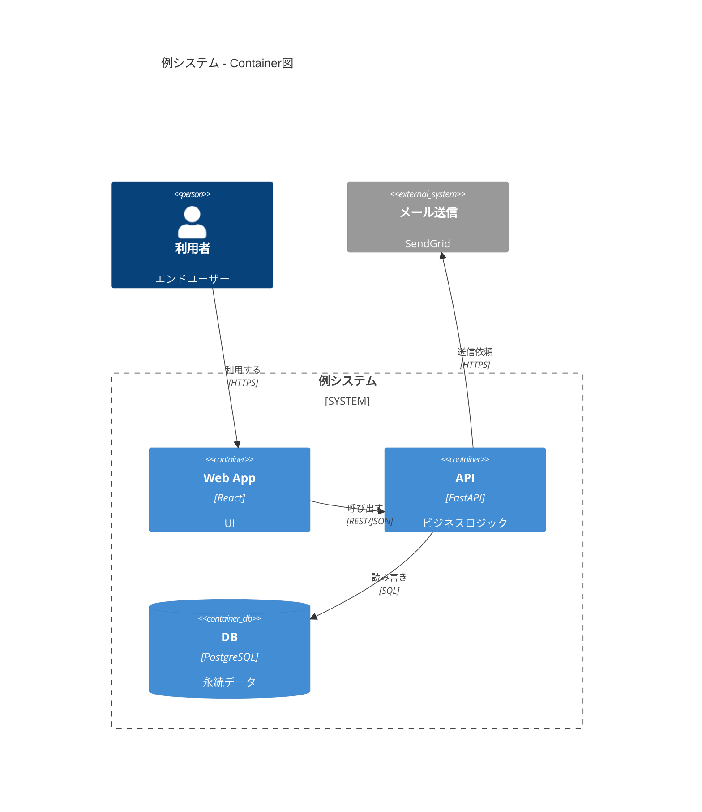

# Mermaid C4 記法ガイド

C4図を Mermaid で書く際の構文リファレンス。図を書き始める直前にこのファイルを参照すること。

> 注: Mermaid の C4 サポートは実験的機能。`Boundary` のネストやレイアウトは描画系によって差異がある。シンプルな構成を心がける。

## 図の種類

```
C4Context     ... System Context図（Level 1）
C4Container   ... Container図（Level 2）
C4Component   ... Component図（Level 3）
C4Dynamic     ... 動的図（処理シーケンス）
C4Deployment  ... デプロイ図
```

`title` で図のタイトルを指定する。

## 要素（エレメント）

各引数は `(alias, "ラベル", "技術/種別", "説明")` の順。alias は英数字の一意な識別子。

```
Person(alias, "名前", "説明")
Person_Ext(alias, "名前", "説明")              ... 外部の人物

System(alias, "名前", "説明")
System_Ext(alias, "名前", "説明")              ... 外部システム
SystemDb(alias, "名前", "説明")
SystemQueue(alias, "名前", "説明")

Container(alias, "名前", "技術", "説明")
ContainerDb(alias, "名前", "技術", "説明")       ... データストア
ContainerQueue(alias, "名前", "技術", "説明")    ... キュー
Container_Ext(alias, "名前", "技術", "説明")

Component(alias, "名前", "技術", "説明")
ComponentDb(alias, "名前", "技術", "説明")
ComponentQueue(alias, "名前", "技術", "説明")
```

## 境界（バウンダリ）

```
System_Boundary(alias, "名前") { ... }      ... Container図でシステム境界を表す
Container_Boundary(alias, "名前") { ... }    ... Component図でコンテナ境界を表す
Enterprise_Boundary(alias, "名前") { ... }   ... 組織境界
Boundary(alias, "名前", "type") { ... }      ... 汎用境界
```

## 関係（リレーション）

```
Rel(from, to, "ラベル", "技術/プロトコル")     ... 矢印（technology は省略可）
BiRel(from, to, "ラベル", "技術")             ... 双方向矢印

Rel_U / Rel_Up(from, to, "ラベル", "技術")     ... 上方向
Rel_D / Rel_Down(...)                         ... 下方向
Rel_L / Rel_Left(...)                         ... 左方向
Rel_R / Rel_Right(...)                        ... 右方向
```

方向付き Rel はレイアウト調整に有用。

## レイアウト調整

```
UpdateLayoutConfig($c4ShapeInRow="3", $c4BoundaryInRow="2")
UpdateElementStyle(alias, $bgColor="...", $fontColor="...", $borderColor="...")
UpdateRelStyle(from, to, $textColor="...", $lineColor="...", $offsetX="..", $offsetY="..")
```

## 最小サンプル（Container図）



## よくあるエラーと注意点

- ラベル・説明内の `"` はそのまま使えない。避けるか別の表現にする
- alias は重複不可。同じ alias を2回定義しない
- `Rel` は定義済みの alias 同士のみ。未定義 alias を参照しない
- 関係が多すぎると描画が乱れる。重要な関係に絞る。要素は1図あたり概ね10〜15個まで
- Boundary の深いネストは描画が崩れやすい。Container図とComponent図を分けて段階的に詳細化する
