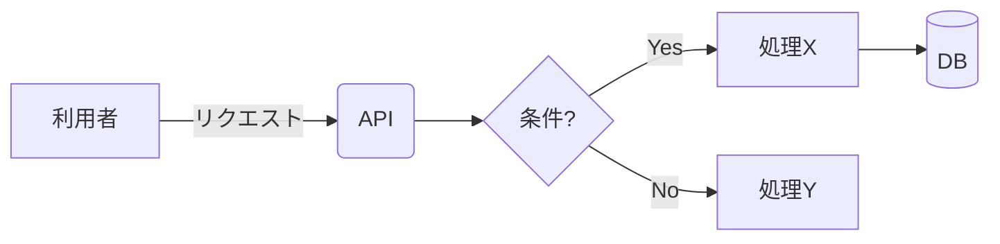
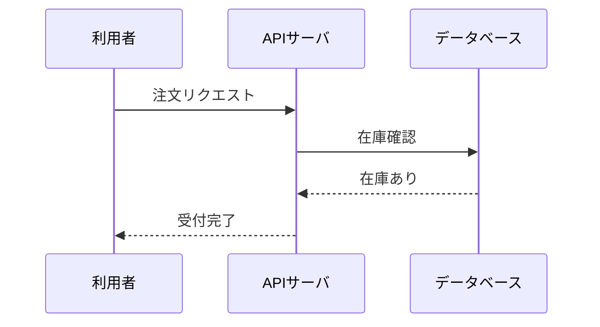
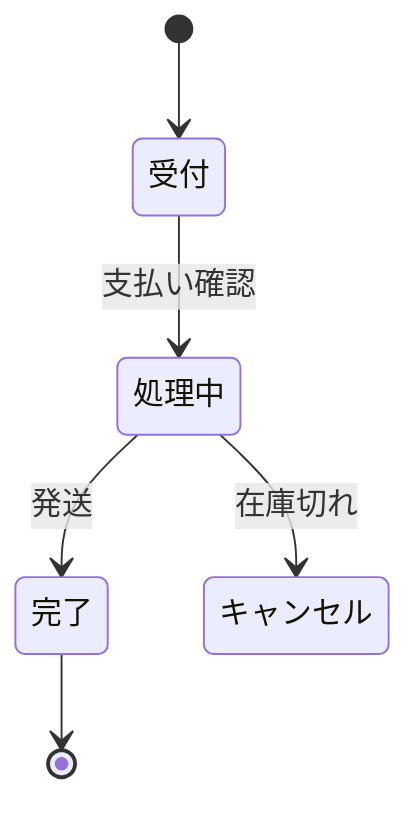
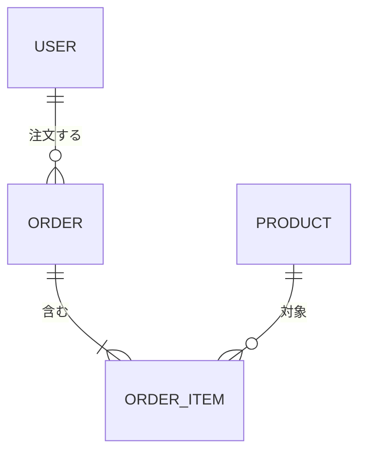
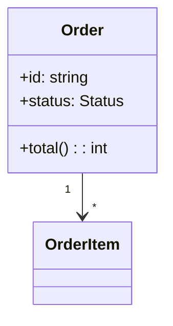
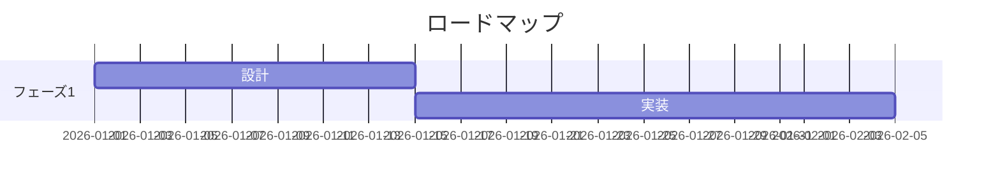

# mermaid 図の選び方・記法ガイド

「セクションごとに図を1枚」を実践するための、図の選択基準と最小記法集。**内容に合う種類を選ぶ**こと（迷ったら flowchart）。すべてレンダリング可能な構文で書く。

## 何を描きたいか → どの図か

| 描きたいもの | 図の種類 | 典型シーン |
|--------------|----------|------------|
| 全体像・処理の流れ・分岐 | `flowchart` | サマリの全体像、処理フロー、判断分岐 |
| 時系列のやり取り | `sequenceDiagram` | API 呼び出し、コンポーネント間通信、認証フロー |
| 状態と遷移 | `stateDiagram-v2` | ライフサイクル、ステータス管理、注文/ジョブの状態 |
| データ構造・テーブル関係 | `erDiagram` | DB スキーマ、エンティティ関係 |
| クラス・型・責務 | `classDiagram` | ドメインモデル、モジュール構造 |
| 工程・スケジュール | `gantt` | ロードマップ、フェーズ計画 |
| 階層・分類・分解 | `flowchart TB` or `mindmap` | 構成要素の分解、目次的な俯瞰 |

## 最小記法サンプル

### flowchart（全体像・フロー）

- 向き: `TB`（上→下）/ `LR`（左→右）。全体像は情報量が多ければ `TB` が読みやすい。
- ノード形: `[ ]` 四角 / `( )` 角丸 / `{ }` 判断 / `[( )]` DB / `(( ))` 円。
- グルーピングは `subgraph 名前 ... end`。

### sequenceDiagram（時系列のやり取り）

- 実線 `->>` は呼び出し、破線 `-->>` は応答。
- `alt / else / end`、`loop / end`、`Note over A,B: メモ` が使える。

### stateDiagram-v2（状態遷移）

### erDiagram（データ構造）

- カーディナリティ: `||`(1) / `o{`(0以上) / `|{`(1以上)。

### classDiagram（モデル・責務）

### gantt（工程・計画）

## 描くときの注意

- **1枚に詰め込みすぎない。** ノードが多いなら `subgraph` でまとめるか、図を分割する。
- **日本語ラベル**は原則そのまま使えるが、`:` `;` などの特殊記号を含むラベルは `"..."` で囲む。
- 矢印には**動詞ラベル**を付けて意味を明確にする（`-->|確認|` など）。
- 出力前に構文エラー（閉じ忘れ、未定義ノード、向き指定漏れ）がないか見直す。
