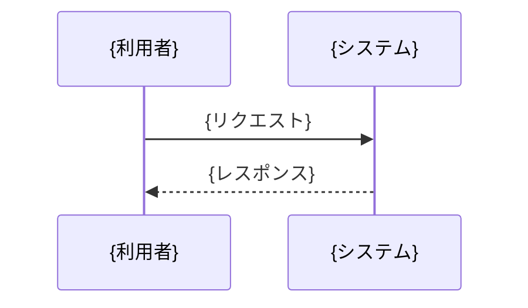

# ドキュメント雛形（そのままコピーして埋める）

以下は生成するドキュメントの標準骨子。見出しは残し、`{ }` を実内容に置き換える。不要な補助見出しは削ってよいが、**冒頭サマリの3要素（目的・全体像図・比喩）とセクション分割・図解の方針は必ず守る**。

---

````markdown
# {ドキュメントのタイトル}

## サマリ

### この資料の目的

- **読者**: {想定読者}
- この資料を読むと、次のことが分かる:
  - {分かること1}
  - {分かること2}
  - {分かること3}

### 全体像

```mermaid
flowchart TB
    A[{登場人物/要素1}] --> B[{要素2}]
    B --> C[{要素3}]
    B --> D[{要素4}]
```

> 上の図の {どの部分} を第2章、{どの部分} を第3章で説明する。

### ひとことで言うと（たとえ話）

{要するに、これは「◯◯における△△のようなもの」。中学生にも伝わる身近な比喩で1〜3文。専門用語は使わない。}

---

## 1. {最初のトピック}

{リード文は1〜2文まで。すぐ図か箇条書きへ。}

- {ポイント}
- {ポイント}

### 1-1. {サブトピック}



### 1-2. {サブトピック}

| 項目 | 説明 |
|------|------|
| {項目} | {説明} |

## 2. {次のトピック}

- {ポイント}

```mermaid
stateDiagram-v2
    [*] --> {状態A}
    {状態A} --> {状態B}: {遷移条件}
    {状態B} --> [*]
```

## 3. {さらに次のトピック}

（以降、トピックごとにセクションを細かく分ける。各セクションに図・表・箇条書きのいずれかを必ず入れる。）

## 補足 / 用語

- **{用語}**: {ひとこと説明（できれば比喩を添える）}
````

---

## 冒頭サマリの書き分けの要点

- **目的（1-1）**: 「〜について説明します」で終わらせない。「読むと〇〇が判断できる／〇〇を実装できる／〇〇の全体像が分かる」まで書く。
- **全体像（1-2）**: 図の下に「この図のどこを本文のどこで説明するか」を1文添えると、地図として機能する。
- **比喩（1-3）**: 資料全体を1つのたとえで包む。個々の用語の比喩は本文や「補足/用語」で個別に添える。

## 比喩の例（そのまま流用可・題材の引き出し）

| 説明したい概念 | 比喩 |
|----------------|------|
| システム全体 | 「注文を受けて料理を作り届けるレストランのようなもの」 |
| API / インターフェース | 「店の注文カウンター。決まった形で頼めば決まった形で返ってくる」 |
| キュー / 非同期処理 | 「レジに並ぶ行列。順番が来たら処理される」 |
| ロードバランサ | 「空いている窓口へ客を案内する整理係」 |
| キャッシュ | 「よく使う道具を引き出しの手前に置いておくこと」 |
| データベース | 「きちんと索引の付いた大きな倉庫」 |
| 認証・認可 | 「入館証のチェック。持っている人だけ、許された部屋に入れる」 |
| リトライ / フォールバック | 「電話がつながらなかったら、少し待ってかけ直す・別の番号にかける」 |
| パイプライン | 「工場のベルトコンベア。各工程を順に通って完成する」 |

> 題材はテーマに合わせて置き換えてよい。大切なのは「中学生の生活圏にあるもの」で「専門用語を使わない」こと。
