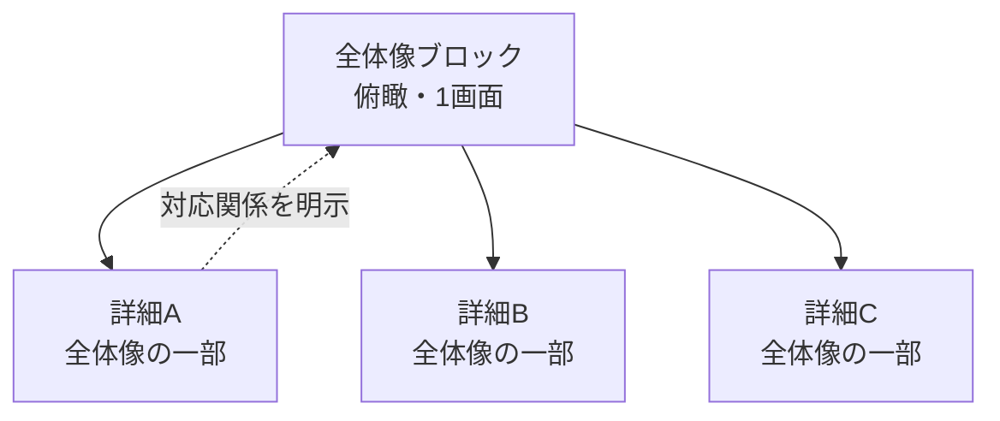

# 動的ドキュメント化スキル（dynamic-doc）

静的なドキュメント（設計書・アーキテクチャ資料・仕様書・ユースケース資料など）を読み込み、その内容を
**インタラクティブに操作・再生できる1枚の自己完結HTML** に変換するスキル。

テキストや静的なMermaid図では潰れてしまう情報（大量のノードを持つ依存グラフ、往復する矢印、長い処理フロー、
状態遷移）を、**ステップ再生・フォーカス・フィルタ・ドリルダウン** といった動的表現へ置き換え、
読み手が抽象的な構造を段階的に把握できるようにする。

---

# ゴール

このスキルの目的は、ドキュメントを見た目よく HTML化することではない。

> **静的資料では把握しづらい抽象構造を、操作しながら段階的に理解できる状態にすること**

である。したがって常に以下を満たす。

- 元資料の内容に忠実である（存在しない関係を捏造しない。推測は「推定」と明示する）
- 動的表現は「理解のため」に選ぶ。理解を助けないアニメーションや装飾は入れない
- 大規模な図でも潰れない（フォーカス／フィルタ／検索で必要な部分だけを見られる）
- 時系列・手順・状態遷移は、1ステップずつ再生・逆再生できる
- 生成物は1枚のHTMLで、ブラウザで開くだけで動く（配布・共有が容易）

---

# 全体像

```mermaid
flowchart TD
    D[対象ドキュメント<br/>設計書 / 仕様 / 図] --> S1[Step1 読解・モデル抽出]
    S1 --> M[概念モデル<br/>ノード/エッジ/ステップ/状態/階層]
    M --> S2[Step2 表現設計<br/>内容→パターン対応]
    S2 --> S3[Step3 生成<br/>単一HTML]
    S3 --> S4[Step4 検証・セルフレビュー]
    S4 -->|不足あり| S2
    S4 --> OUT[outputs/dynamic-doc/&#123;名前&#125;.html]

    subgraph P[動的表現パターン]
      P1[① ステップ再生]
      P2[② 依存グラフ探索]
      P3[③ レイヤードリルダウン]
      P4[④ 状態/タイムライン遷移]
    end
    S2 -.選択.-> P
```



---

# 動的資料のフォーマット（必須構成）

生成する動的HTMLは、常に次の構成規約に従う。これは `doc-format` スキルの「冒頭サマリ → 詳細」「図ファースト」を、
動的資料へ適用したもの。**内容やパターンが変わっても、この構成規約は必ず守る。**

## 1. まず全体像（俯瞰ブロック）を置く

- 資料の先頭（左ナビの最上段）に、対象全体を1枚で見渡せる **全体像ブロック** を必ず置く。
- 全体像は、主要な登場人物・コンポーネント・大きな流れを1画面で俯瞰できるものにする
  （多くは ② 依存グラフ、または ③ ドリルダウンの最上位レベル）。
- 読み手が **全体像だけで骨格（何が・どう繋がっているか）をつかめる** 状態にする。

## 2. 後続ブロックは「全体像の詳細」にする

- 2枚目以降のブロックは、全体像の **どこか一部分を掘り下げた詳細** にする。
  （例: 全体像のノード「決済サービス」→ 詳細ブロック「決済フローのステップ再生」）
- 各詳細ブロックは、**全体像のどの要素に対応するか** を明示する（全体像との対応を崩さない）。
- 全体像の要素から、対応する詳細ブロックへ移動できる **導線** を張る（クリックでジャンプ／ドリルダウン）。
- 左ナビは「全体像 → その詳細群」の親子関係が分かる並び・字下げにする。



## 3. 図（動的表現）を主役にし、テキストは最小限

- 情報は可能な限り **図・動的表現** で伝える。地の文の長文は置かない。
- テキストは「ステップのナレーション」「凡例」「短い補足」に限定し、1画面に詰め込まない。
- 図で表せることを、テキストで説明し直さない（図とテキストで内容を重複させない）。

---

# 動的表現パターン（中核機能）

本スキルは4つの動的表現パターンを持つ。内容の形に応じて選び、1つのHTML内に複数配置してよい。
**書き始める直前に、使うパターンの reference を必ず読むこと。**

| パターン | 向いている内容 | 共有エンジン | reference |
| --- | --- | --- | --- |
| ① ステップ再生プレイヤー | ユースケース・シーケンス・処理フロー・手順・アルゴリズム | プレイヤー | [references/step-player.md](references/step-player.md) |
| ② 依存グラフ探索 | アーキテクチャ図・コンポーネント/モジュール依存・サービスマップ | グラフ | [references/dependency-graph.md](references/dependency-graph.md) |
| ③ レイヤードリルダウン | C4的な階層（Context→Container→Component）・入れ子の分解 | グラフ | [references/layer-drilldown.md](references/layer-drilldown.md) |
| ④ 状態/タイムライン遷移 | 状態機械・ライフサイクル・時系列の変化・イベント列 | プレイヤー | [references/state-timeline.md](references/state-timeline.md) |

パターン選択の基準と、内容→パターンの対応表は [references/patterns.md](references/patterns.md) を参照。

生成物の土台（単一HTMLの雛形・共通レイアウト・デザイン・操作UI・2つの共有エンジン）は
[references/html-scaffold.md](references/html-scaffold.md) に定義する。**生成前に必ず読むこと。**

---

# 対象の解決

1. ユーザーが対象ドキュメントのパス（ファイル/ディレクトリ）を指定した場合はそれを対象とする
2. 指定がなければ、カレントディレクトリ内の設計資料（`*.md`, `docs/` 等）を探して確認する
3. 対象が複数ファイルにまたがる場合は、可能な限りすべて読み、1つの概念モデルに統合する
4. 対象・出力名・強調したい観点が曖昧な場合はユーザーに確認する

以降、出力の識別名を `{名前}` と表記する（資料名・システム名など内容を端的に表す名前。英語kebab-caseにする）。

---

# 作業フロー

各ステップで **必ず `tmp/dynamic-doc/{名前}/` 配下に中間成果物を出力する**。会話上の記憶に頼らず、
保存した中間成果物を後続ステップで参照する。

## Step 1: 読解・概念モデル抽出

対象ドキュメントを読み込み、**動的化すべき構造** を抽出する。単に文章を写すのではなく、資料が伝えようと
している概念モデルを構造化データとして取り出す。

抽出する要素の例:

- 登場人物 / アクター / 外部システム
- コンポーネント / モジュール / サービス（＝グラフのノード候補）
- 依存関係 / 呼び出し / データフロー（＝グラフのエッジ候補）
- 処理フロー / ユースケース / シーケンス（＝ステップ候補）
- 状態 / ライフサイクル / 時系列イベント（＝状態/タイムライン候補）
- 階層 / 抽象レベル（＝ドリルダウン候補）

あわせて **「静的資料のどこが把握しづらいか（pain point）」** を特定する。
例: ノードが多く依存が絡む／手順が長く追いにくい／階層が入れ子で全体像が見えない。

**出力**: `tmp/dynamic-doc/{名前}/01_model.md`

```markdown
# 概念モデル: {名前}

## 元資料
- <読んだファイルのパス一覧>

## 把握しづらい点（pain point）
- ...

## ノード（コンポーネント）
| id | ラベル | 種別/レイヤー | 説明 | 出典(推定なら明記) |
|----|--------|-------------|------|------|

## エッジ（依存/フロー）
| source | target | ラベル | 種別 |
|--------|--------|--------|------|

## フロー/ユースケース（ステップ列）
1. <ステップ: 何が起きるか / 強調するノード・エッジ>

## 状態/タイムライン
- 状態: ... / 遷移: ... / シナリオ(トレース): ...

## 階層（ドリルダウン）
- Level1: ... → 各ノードの内部(Level2): ...
```

## Step 2: 表現設計（内容→パターン対応）

抽出したモデルを、どの動的表現パターンでどう見せるかを設計する。1つのHTMLに複数の「ビューブロック」を
持たせてよい（例: ユースケースのステップ再生 + アーキテクチャの依存グラフ）。

パターン選択は [references/patterns.md](references/patterns.md) の基準に従う。迷ったら:

- 「順番に起きること」→ ① ステップ再生
- 「たくさんの箱と矢印」→ ② 依存グラフ探索
- 「大きい→中→小の入れ子」→ ③ レイヤードリルダウン
- 「状態が移り変わる／時間で変わる」→ ④ 状態/タイムライン

**出力**: `tmp/dynamic-doc/{名前}/02_design.md`

**先頭は必ず全体像ブロック**にし、以降は全体像の各部分の詳細に対応させる（「動的資料のフォーマット」参照）。

```markdown
# 表現設計: {名前}

## ビューブロック一覧（1番目＝全体像、以降＝その詳細）
| 順 | ブロック | 役割 | パターン | 見せたいこと | 全体像との対応 |
|----|----------|------|----------|--------------|----------------|
| 1 | 全体構成 | 全体像 | ② 依存グラフ | サービス間の全体依存 | ―（俯瞰） |
| 2 | 認証フロー | 詳細 | ① ステップ再生 | ログインの手順 | 全体像の Web/BFF/認証 |
| 3 | 決済サービス内部 | 詳細 | ③ ドリルダウン | 決済の内部構造 | 全体像の 決済サービス |

## 全体像→詳細の導線
- <全体像のどの要素をクリック/ドリルすると、どの詳細ブロックへ移動するか>

## 各ブロックの操作仕様
- <どの操作を提供するか: 再生/フォーカス/フィルタ/ドリル 等>
```

## Step 3: 生成（単一HTML）

[references/html-scaffold.md](references/html-scaffold.md) の雛形をベースに、Step2で決めたビューブロックを
組み立てる。使うパターンの reference（`step-player.md` / `dependency-graph.md` / `layer-drilldown.md` /
`state-timeline.md`）を読み、そのレシピを **抽出データに合わせて** 実装する。

生成の原則:

- **データとコードを分離する**: 抽出モデルはHTML冒頭の `const DATA = {...}` にまとめ、描画コードはそれを
  消費する。こうすることで内容の忠実性を検証しやすく、再生成も容易になる。
- **自己完結**: CSS/JSはインライン。グラフ描画（Cytoscape.js 等）のみCDNから読み込む。
- **共有エンジンを再利用**: ①④はプレイヤーエンジン、②③はグラフエンジンを使う（scaffold参照）。

**出力**: `outputs/dynamic-doc/{名前}.html`

## Step 4: 検証・セルフレビュー

1. HTML/JSに構文エラーがないか確認する
2. ブラウザで開いて動作確認する（ユーザーに開いてもらうか、`python3 -m http.server` 等を案内）
3. 末尾のセルフレビューチェックリストで自己点検する
4. 不足があれば Step 2/3 に戻る

**検証補助（任意）**: 生成HTMLの JS を Node で軽く構文チェックできる。
`node --check <(sed -n '/<script>/,/<\/script>/p' file.html)` 相当の確認や、ブラウザのコンソールエラー確認を行う。

---

# 一時作業領域と出力

```text
tmp/dynamic-doc/{名前}/
├── 01_model.md      # 概念モデル抽出
├── 02_design.md     # 表現設計
└── notes.md         # 補足（任意）

outputs/dynamic-doc/
└── {名前}.html       # 最終成果物（1枚で完結）
```

- 中間成果物は `tmp/` に置き、既存を上書きしない。
- 誤コミット防止のため、対象PJの `.gitignore` に `tmp/` を追加する（既に無視されていれば不要）。
- 複数対象を扱う場合は `{名前}` ごとにディレクトリを分ける。

---

# セルフレビューチェックリスト

## 構成（フォーマット）
- [ ] 先頭に全体像（俯瞰）ブロックがあり、それだけで骨格をつかめるか
- [ ] 後続ブロックは全体像の一部の詳細で、全体像との対応が明示されているか
- [ ] 全体像から詳細への導線（クリック/ドリル/ナビ）があるか
- [ ] 左ナビが「全体像 → 詳細群」の親子で並んでいるか
- [ ] 図・動的表現が主役で、地の文の長文がない（テキスト最小限）か

## 忠実性
- [ ] ノード・エッジ・ステップ・状態は元資料に基づくか（捏造していないか）
- [ ] 推測で補った箇所は「推定」と明示したか
- [ ] 元資料の pain point（潰れる図・長い手順など）が実際に解消されているか

## 動的表現
- [ ] 選んだパターンは内容の形に合っているか（順番→再生 / 依存→グラフ 等）
- [ ] 大規模グラフでフォーカス・フィルタ・検索が機能し、潰れずに読めるか
- [ ] 手順・状態遷移が1ステップずつ再生・逆再生でき、現在位置が分かるか
- [ ] 理解を助けない装飾・アニメーションを入れていないか

## 成果物
- [ ] 1枚のHTMLで自己完結し、ブラウザで開くだけで動くか
- [ ] データ(`DATA`)と描画コードが分離されているか
- [ ] JS/HTMLに構文エラーがないか
- [ ] 操作UI（再生/フォーカス/フィルタ/ドリル）に説明・凡例・キーボード操作があるか
- [ ] ライト/ダーク両方で読めるコントラストか
- [ ] 出力ファイル名は英語kebab-caseか

---

# 行動指針

- すべてのやり取り・資料内テキストは日本語で書く（英語指定がある場合を除く）。
- **必ず全体像を先頭に置き、後続を全体像の詳細として構成する**（「動的資料のフォーマット」を順守）。
- **図・動的表現を主役にし、テキストは最小限**。図で表せることを地の文で書き足さない。
- **元資料への忠実性を最優先**。動的化は理解を助けるための手段であり、内容を盛らない。
- 大規模・複雑な内容ほど価値が出る。要素が少なく静的図で十分なら、そのことを正直に伝える。
- 迷う設計判断はユーザーに確認する（対象・強調したい観点・パターン選択）。
- コード（JS/CSS）はレンダリング可能な状態で出力する。CDNが使えない環境向けにライブラリをインライン化する
  オプションもあることを認識しておく。
