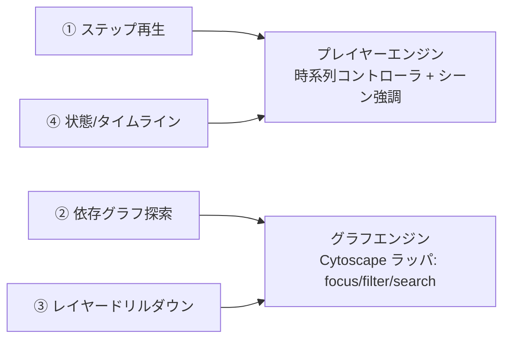

# 動的表現パターンの選択基準

内容の「形」から、どのパターンで表現すべきかを判断するためのガイド。1つのHTMLに複数パターンを配置してよい。

---

## 内容の形 → パターン対応表

| 元資料に出てくるもの | 内容の形 | 選ぶパターン |
| --- | --- | --- |
| ユースケース、シーケンス図、処理フロー、手順書、アルゴリズム | 順番に起きる一連のステップ | ① ステップ再生プレイヤー |
| アーキテクチャ図、コンポーネント/モジュール依存、サービスマップ、ER的関連 | たくさんのノードと矢印の網 | ② 依存グラフ探索 |
| C4モデル、システム→サブシステム→モジュール、入れ子の分解 | 抽象度の異なる階層 | ③ レイヤードリルダウン |
| 状態遷移図、ライフサイクル、デプロイ段階、パイプラインの時間変化、イベント年表 | 状態が移り変わる / 時間で変わる | ④ 状態/タイムライン遷移 |

---

## 判断のヒント

### ① ステップ再生を選ぶ合図
- 「まず〜し、次に〜する」という **順序** が本質
- シーケンス図・アクティビティ図・フローチャートで描かれている
- 手順が長く、静的図では「今どこの話か」が追いにくい
- → 1ステップずつ強調し、ナレーションを同期表示すると理解が跳ね上がる

### ② 依存グラフ探索を選ぶ合図
- ノードが多く（目安10個以上）、矢印が往復・交差して静的図が **潰れる/絡む**
- 「あるコンポーネントに依存しているのは誰か」を追いたい
- レイヤー・種別でグルーピングできる
- → クリックで近傍だけ強調（focus+context）、種別でフィルタ、検索で解決

### ③ レイヤードリルダウンを選ぶ合図
- 全体像と詳細を **1枚に描くと情報過多** になる
- C4のように「文脈→コンテナ→コンポーネント」と段階的に降りられる
- あるノードの「中身」が別の図として存在する
- → 俯瞰から始め、クリックで内部へズームイン、パンくずで戻る

### ④ 状態/タイムライン遷移を選ぶ合図
- 同じ登場人物が **時間や状態によって振る舞いを変える**
- 「この状態のときだけこの遷移が起きる」を辿りたい
- デプロイ/障害/データ処理などを時系列で追いたい
- → シナリオ（トレース）に沿って状態を1つずつ点灯、イベントログと現在状態を同期

---

## 複数パターンの組み合わせ例

1枚のHTMLに複数の「ビューブロック」を置き、左のナビ（TOC）で切り替える。
**必ず先頭を全体像ブロックにし、以降を全体像の詳細として並べる**（SKILL.md「動的資料のフォーマット」）。
下表は「全体像 → 詳細群」の順で示す。

| 元資料 | 先頭＝全体像 | 詳細（全体像の各部分） |
| --- | --- | --- |
| Webサービスの設計書 | ② 全体アーキテクチャの依存グラフ | ① 主要ユースケースのステップ再生 |
| マイクロサービス基盤 | ② サービス間依存グラフ | ③ 各サービス内部のドリルダウン |
| 決済システム仕様 | ② 決済系の全体構成グラフ | ④ 決済状態機械の遷移再生 ／ ① 正常系フロー |
| データ基盤 | ② データフロー依存グラフ | ④ パイプラインのタイムライン |

全体像グラフのノードに `linkTo:'<詳細blockのid>'` を張れば、俯瞰から該当詳細へダブルクリックで移動できる。

---

## パターンと共有エンジンの関係

実装は2つの共有エンジンに集約される（[html-scaffold.md](html-scaffold.md) 参照）。

- **プレイヤーエンジン**: 再生/停止/前後/スライダー/速度を持つ時系列コントローラと、各ステップで
  シーン（SVG/DOM要素）の強調クラスを切り替えるシーン強調器。①と④で共有する。
- **グラフエンジン**: Cytoscape.js をラップし、クリックで近傍フォーカス、種別フィルタ、検索、
  上流/下流ハイライト、レイアウト切替を提供する。②と③で共有する（③はデータを差し替えて再利用）。

新しいパターンを足したくなったら、まずこの2エンジンのどちらで実現できるかを考える。
